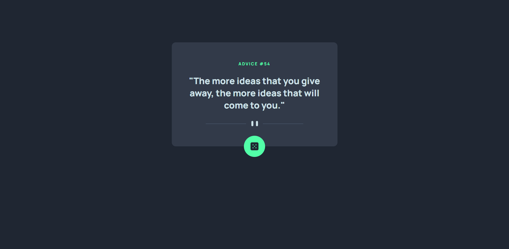

# Frontend Mentor - Advice generator app solution

This is a solution to the [Advice generator app challenge on Frontend Mentor](https://www.frontendmentor.io/challenges/advice-generator-app-QdUG-13db). Frontend Mentor challenges help you improve your coding skills by building realistic projects.

## Table of contents

- [Overview](#overview)
  - [The challenge](#the-challenge)
  - [Screenshot](#screenshot)
  - [Links](#links)
- [My process](#my-process)
  - [Built with](#built-with)
  - [What I learned](#what-i-learned)
  - [Continued development](#continued-development)
  - [Resources](#resources)
- [Author](#author)

## Overview

### The challenge

Users should be able to:

- View the optimal layout for the app depending on their device's screen size
- See hover states for all interactive elements on the page
- Generate a new piece of advice by clicking the dice icon

### Screenshot



### Links

- Solution URL: [Github Repository](https://github.com/Rova1/frontend-mentor-advice-generator)
- Live Site URL: [Live site](https://rova1.github.io/frontend-mentor-advice-generator/)

## My process

### Built with

- BEM naming convention
- CSS custom properties
- Mobile-first workflow
- fetch API
- Reponsive images in HTML

### What I learned

With this project I reinforced my recently aquired knowledge about the fetch API and asynchronous programming in general.
I made a GET request to the Advice Slip API and handled the data using the .then() method.
I also included error handling with the .catch() method.

The most important code I wanted to practice with this project is the following:

```js
fetch('https://api.adviceslip.com/advice')
  .then(response => {
    if (!response.ok) throw new Error(response.status);
    return response.json();
  })
  .then(data => {
    labelAdvice.textContent = data.slip.advice;
    labelId.textContent = data.slip.id;
  })
  .catch(err => {
    CtrError.classList.remove('hidden');
    labelError.textContent = `An error occurred while getting advice: ${err.message}`;
  });
```

I also learned how to use the 'picture' and 'source' elements to have the browser choose between different images based on the viewport.

The code for this is:

```html
<picture>
  <source
    srcset="images/pattern-divider-desktop.svg"
    media="(min-width: 600px)"
  />
  
</picture>
```

Lastly I learned how to avoid 'sticky hover styles' on touch devices like phones and tablet using this media query:

```css
@media (hover: hover) {
  .advice__btn:hover {
    box-shadow: 0 0 3px 3px var(--clr-primary);
  }
}
```

### Continued development

After finishing this very simple project, I want to complete some more API projects with more complicated requirements.

### Resources

- [A Guide to the Responsive Images Syntax in HTML](https://css-tricks.com/a-guide-to-the-responsive-images-syntax-in-html/)
- [Solving Sticky Hover States with @media (hover: hover)](https://css-tricks.com/solving-sticky-hover-states-with-media-hover-hover/)

## Author

- Frontend Mentor - [@Rova1](https://www.frontendmentor.io/profile/Rova1)
